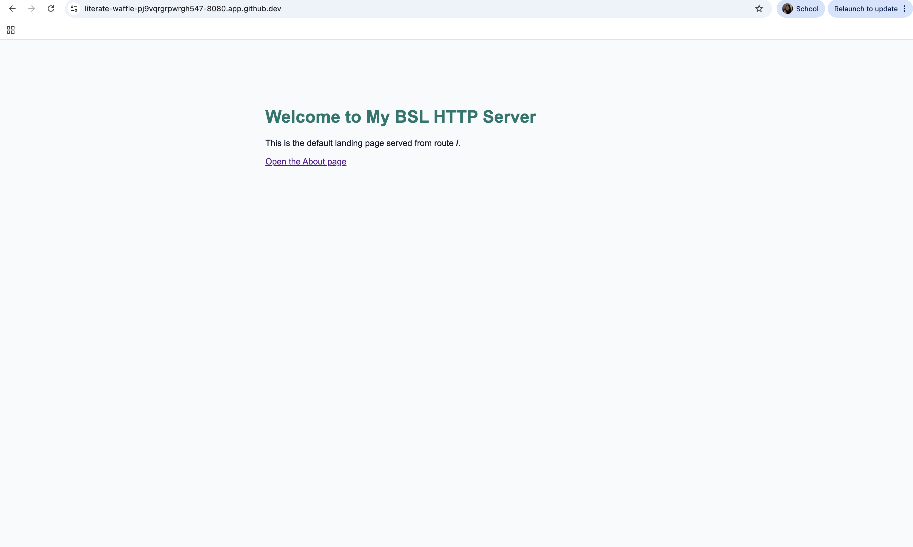
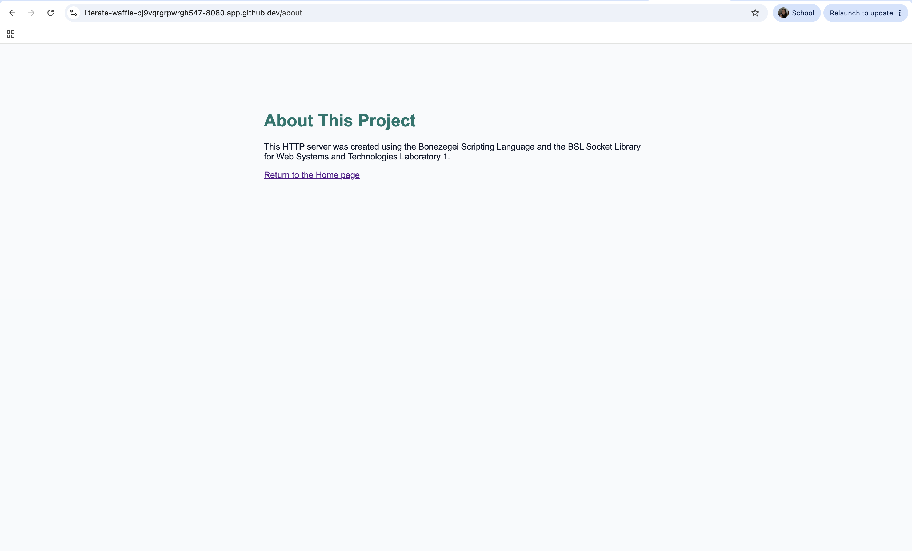
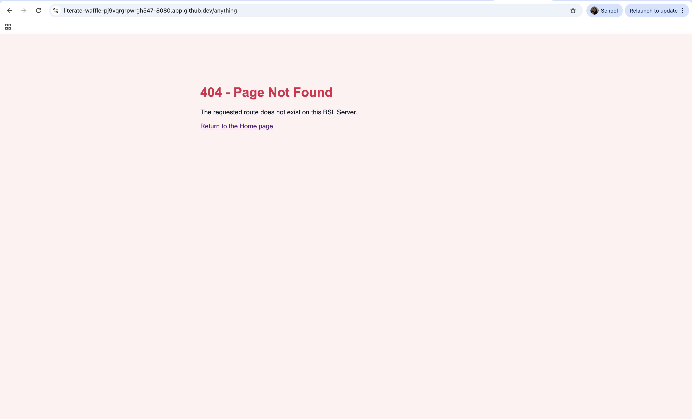
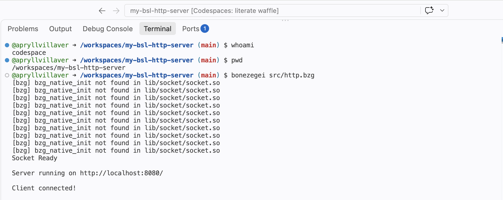

# From Socket to Web Page: My BSL HTTP Server

> **Laboratory Activity 1: Building an HTTP Server Using Socket**
> Web Systems and Technologies

This repository documents my first low-level HTTP server built using the **Bonezegei Scripting Language (BSL)** and the **BSL_Socket library**. Instead of relying on an existing web framework, the project handles the basic server process directly, from opening a TCP socket to returning an HTML page to the browser.

---

## 🧭 Project Description

When we normally open a website, the browser hides most of the communication happening behind the page. This activity explores that process at a lower level.

The server waits for a browser to connect, reads the raw HTTP request, identifies the requested path, and manually creates the appropriate HTTP response. It supports a Home page, an About page, and a custom 404 page for any route that has not been defined.

Since I developed this project using a MacBook and the current BSL interpreter is intended for Windows and Linux, I used **GitHub Codespaces** as my Linux development environment.

---

## 🔎 Project at a Glance

| Component               | Implementation               |
| ----------------------- | ---------------------------- |
| Programming language    | Bonezegei Scripting Language |
| Networking library      | BSL_Socket                   |
| Development environment | GitHub Codespaces            |
| Communication protocol  | HTTP/1.1 over TCP            |
| Request method          | GET                          |
| Server port             | 8080                         |
| Defined routes          | `/` and `/about`             |
| Fallback response       | Custom `404 Not Found` page  |

---

## 🌐 What the Server Does

The server handles three possible routing results:

1. A request to `/` displays the main landing page and returns `HTTP/1.1 200 OK`.
2. A request to `/about` displays information about the project and returns `HTTP/1.1 200 OK`.
3. A request to any undefined route, such as `/anything`, displays a custom error page and returns `HTTP/1.1 404 Not Found`.

Every response includes:

* An HTTP status line
* A `Content-Type` header
* A calculated `Content-Length`
* A `Connection: close` header
* A blank line separating the headers from the body
* An HTML document as the response body

---

## 🔄 From Browser Request to Server Response

The program follows this sequence whenever it runs:

1. `socket_init()` initializes the operating system's socket subsystem.
2. `socket_create()` creates the main TCP server socket.
3. `socket_bind()` attaches the server to port 8080.
4. `socket_listen()` places the socket in listening mode.
5. `socket_accept()` waits for a browser or client to connect.
6. `socket_read()` retrieves the client's raw HTTP request.
7. `regex()` and `substr()` extract the requested path from the first request line.
8. The routing conditions select the correct status code and HTML body.
9. `socket_write()` sends the complete HTTP response.
10. `socket_close()` closes the current client connection.
11. The loop returns to `socket_accept()` and waits for another request.

For example, opening the About page causes the browser to send a request similar to:

```http
GET /about HTTP/1.1
Host: localhost:8080
```

The server extracts `/about`, matches it with the About route, and returns a `200 OK` response containing the corresponding HTML page.

---

## 📁 Repository Structure

```text
my-bsl-http-server/
├── .gitattributes
├── LICENSE
├── README.md
├── src/
│   └── http.bzg
└── documentation/
    ├── home.png
    ├── about.png
    ├── 404.png
    └── terminal.png
```

The BSL package installer also creates a local `lib/` directory containing the socket library. This folder is generated during setup and is not included in the required repository structure.

---

## 🎨 BSL Syntax Highlighting

The `.gitattributes` file contains:

```gitattributes
*.bzg linguist-language=JavaScript
```

This tells GitHub to display `.bzg` source files using JavaScript syntax highlighting because BSL uses a similar C-style and JavaScript-style syntax.

---

## 🛠️ Installation and Setup

### 1. Create a GitHub Codespace

From the main repository page:

1. Click the green **Code** button.
2. Open the **Codespaces** tab.
3. Select **Create codespace on main**.
4. Wait for the browser-based VS Code environment to load.

### 2. Install the BSL VS Code extension

Open the Extensions panel and search for:

```text
Bonezegei Scripting Language Formatter
```

Install the extension to enable editor support and formatting for `.bzg` files.

### 3. Confirm the Codespace architecture

Open the terminal and run:

```bash
uname -m
```

The expected result is:

```text
x86_64
```

This architecture is compatible with the Linux version of the BSL interpreter and the BSL_Socket library used in the project.

### 4. Download the BSL interpreter

```bash
wget -O /tmp/Bonezegei-x86.deb https://github.com/bonezegei/Bonezegei_Scripting_Language/raw/refs/heads/main/Release/Latest/Bonezegei-x86.deb
```

The package is downloaded to `/tmp` so the installer does not become part of the repository.

### 5. Install the interpreter

```bash
sudo apt install -y /tmp/Bonezegei-x86.deb
```

### 6. Verify the BSL installation

Check the interpreter:

```bash
bonezegei --version
```

Check the BSL package installer:

```bash
bzg --version
```

Test a simple inline BSL statement:

```bash
bonezegei --inline 'print("Hello World");'
```

A successful setup should display:

```text
Hello World
```

### 7. Install the BSL_Socket library

Make sure the terminal is in the root directory of the repository, then run:

```bash
bzg install socket
```

This installs the files required by the following line in `src/http.bzg`:

```javascript
include("lib/socket.bzg");
```

---

## ▶️ Running the Server

Confirm that the terminal is in the project directory:

```bash
pwd
```

The result should look similar to:

```text
/workspaces/my-bsl-http-server
```

Start the server:

```bash
bonezegei src/http.bzg
```

A successful startup displays:

```text
Socket Ready
Server running on http://localhost:8080/
```

The terminal remains active because the server is continuously waiting for incoming connections. To stop it, press:

```text
Control + C
```

---

## 🔗 Opening the Server in Codespaces

GitHub Codespaces automatically forwards port `8080` when the server starts.

To open the application:

1. Select the **Ports** tab beside the terminal.
2. Locate port `8080`.
3. Click its forwarded address or open-browser icon.
4. Use the generated `app.github.dev` address to access the server.

The forwarded address follows this general format:

```text
https://CODESPACE-NAME-8080.app.github.dev/
```

The Codespace name is automatically generated by GitHub and may be different from the repository name. It still points to the server running inside the correct repository.

---

## 🗺️ Available Routes

| Route              | Purpose                                | Expected HTTP Status |
| ------------------ | -------------------------------------- | -------------------- |
| `/`                | Displays the default landing page      | `200 OK`             |
| `/about`           | Displays information about the project | `200 OK`             |
| `/anything`        | Tests the fallback route               | `404 Not Found`      |
| Any undefined path | Displays the custom error page         | `404 Not Found`      |

### Home Page

```text
https://CODESPACE-NAME-8080.app.github.dev/
```

### About Page

```text
https://CODESPACE-NAME-8080.app.github.dev/about
```

### Undefined Route

```text
https://CODESPACE-NAME-8080.app.github.dev/anything
```

---

## ✅ Verifying the HTTP Status Codes

The browser confirms that the HTML pages are displayed, but the response codes can also be tested directly.

While the server is running, open a second Codespaces terminal and execute:

```bash
curl -s -o /dev/null -w "Home: %{http_code}\n" http://localhost:8080/
```

```bash
curl -s -o /dev/null -w "About: %{http_code}\n" http://localhost:8080/about
```

```bash
curl -s -o /dev/null -w "Unknown: %{http_code}\n" http://localhost:8080/anything
```

The expected results are:

```text
Home: 200
About: 200
Unknown: 404
```

These results confirm that the server returns the correct HTTP status for each route.

---

## 📸 Screenshots

### Default Landing Page

The root route successfully returns the main HTML page.



### About Page

The `/about` route returns information about the server project.



### Custom 404 Page

An undefined path returns the custom error page and the correct `404 Not Found` response.



### Server Running in GitHub Codespaces

The terminal shows the repository directory, BSL command, and active server on port 8080.



---

## 🧩 Implementation Choices and Limitations

The project was intentionally kept small and procedural so that the socket and HTTP lifecycle could be observed clearly.

The server:

* Processes one client connection at a time
* Supports basic HTTP GET requests
* Stores each HTML page directly inside the BSL source code
* Closes the client connection after every response
* Uses manual route matching
* Uses plain HTTP inside the Codespace before GitHub forwards it through its browser-accessible address

This implementation is suitable for learning how HTTP works at the socket level. It is not intended to replace a production web server.

Possible future improvements include:

* Moving the HTML pages into separate files
* Supporting additional HTTP methods
* Adding more routes
* Improving request parsing
* Supporting multiple clients concurrently
* Adding server-side logging
* Providing custom CSS files and reusable page layouts

---

## 💭 What I Learned

The most useful part of this activity was seeing that an HTTP request is simply formatted text sent through a TCP connection. The requested route appears inside the first line, and the server must read and interpret that line before it can decide which page to return.

I also learned that an HTML body alone is not enough to form a correct response. The server must provide the status line, headers, content length, connection behavior, and the required blank line between the headers and body.

Working through GitHub Codespaces also helped me understand how a local server running inside a remote Linux environment can be accessed through a forwarded port. Although the browser displayed an HTTPS Codespaces address, the BSL application itself was still listening internally on port 8080.

---

## 📚 Resources

* [Bonezegei Scripting Language](https://github.com/bonezegei/Bonezegei_Scripting_Language)
* [BSL_Socket Library](https://github.com/bonezegei/BSL_Socket)
* [Bonezegei Scripting Language Documentation](https://bonezegei.com/tutorials/bsl/start)
* [GitHub Codespaces Documentation](https://docs.github.com/en/codespaces)

---

## 📄 License

This project is distributed under the MIT License. See the [LICENSE](LICENSE) file for the complete license terms.
